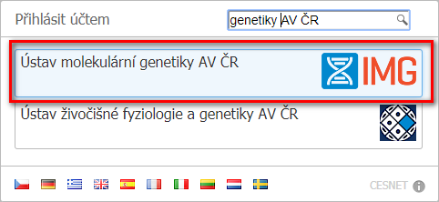
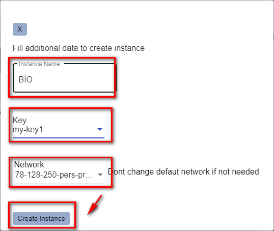
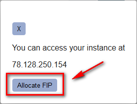
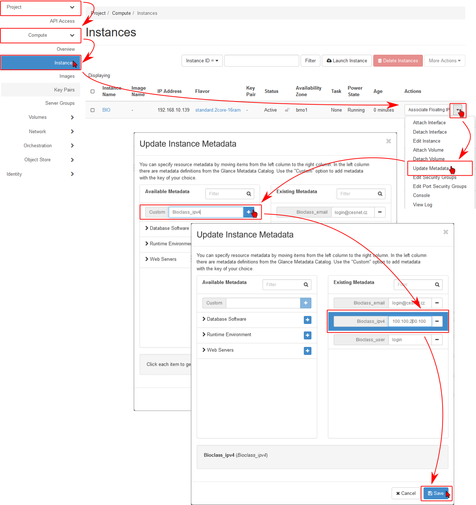

# Launch instance with BIO software using frontend application

* If you do not have a MetaCentrum account, please try to create it according to the documentation at [cloud pages][cloud]
* The teacher should then add all students to the bioconductor group at https://perun.metacentrum.cz. This is necessary to provide access to the folder on NFS, etc. Also, we need to report the added logins to our Openstack colleagues for further action.

## Frontend application

[Frontend][bio-portal] automates the steps required to launch the instance.
The interface for manual startup and necessary settings that the frontend is not yet able to do is [cloud dashboard][cloud-dashboard].

* Launch instance
  * When using the [frontend][bio-portal], log in using EDUID
    * 
  * On the `Consent about releasing personal information` select `Do not ask again` and confirm `Yes, continue`
    * 
  * After logging in using EDUID, a project selection is offered if the user has more than one. If you do not have multiple projects, then you proceed directly to the overview
    * 
  * Start your new instance using button *Bioconductor Deb10*
    * 
  * Instances should be launched in a personal project and with the public-cesnet-78-128-250-PERSONAL network, and this can be edited in the selection
    * Insert *Name* of your new virtual machine
    * Select the public key to use ([Key pair section in manual launch guide][launch-in-personal-project])
    * Check if the network 78-128-25-pers-proj is selected, otherwise select it
    * Click the button *Create Instance*
    * 
  * Wait until the machine launch has finished. Confirm Allocate Floating IP
    * 
    * Connect to the instance using your login, id_rsa key registered in Openstack and Floating IP
    * To prevent Fail2ban to block you because of too many failed login attempts, you may insert new variable *Bioclass_ipv4* containing your public IPv4 address (see for example at [What Is My Public IP Address?](https://www.whatismyip.com)) or edit existing variable to a new value
      * [Open Project](https://cloud.muni.cz/) -> Compute -> Instances and use button on the right of your instance 
      * Click on down arrow and select Update Metadata
      * Click on down arrow and select Update Metadata
      * In Metada dialog insert new variable *Bioclass_ipv4* containing your public IPv4 address (see for example at [What Is My Public IP Address?](https://www.whatismyip.com)) or edit existing variable to a new value
        * Multiple addresses may be inserted with comma as delimiter e.g. `101.101.101.101,102.102.102.102/32,103.103.103.0/24`
        * To remove variable with addresses use button *-* on the right
      * Proceed with **Save** button
      * Wait for approximately 10 minutes until your IP address is inserted into Fail2Ban configuration and service has to be restarted
      * 

[bio-portal]: http://bio-portal.metacentrum.cz
[cloud]: https://cloud.muni.cz
[cloud-dashboard]: https://dashboard.cloud.muni.cz
[launch-in-personal-project]: ./launch-in-personal-project.md#key-pair
